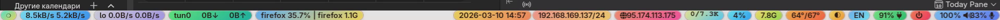

# My VibeBar


Header image source: [Colorful bus Pakistani](https://commons.wikimedia.org/wiki/File:Colorful_bus_Pakistani.jpg) via Wikimedia Commons.

Bright, bus-art Waybar for `niri` on Wayland.



## What is here

- Loud per-chip gradients with compact, tooltip-heavy modules.
- Custom helpers for CPU temperature smoothing, disk I/O, VPN device display, media metadata, external IP, and Niri keyboard layout state.
- A screenshot helper so bar changes can be checked against the live UI instead of config-only guesses.

## Requirements

- `waybar`
- `niri`
- `python3`
- `playerctl` for the media chip
- `curl` for the external IP chip
- `wf-recorder` and `ffmpeg` for `capture-waybar.sh`
- `wl-gammarelay-rs` and optionally `wl-gammarelay-applet`
- `swayosd-client` if you want layout-switch OSD

## Install

This repo is meant to live at `~/.config/waybar`.

```bash
mkdir -p ~/.config/waybar
cp -r . ~/.config/waybar/
chmod +x ~/.config/waybar/*.py ~/.config/waybar/*.sh
pkill -SIGUSR2 waybar
```

## Notes

- The config is not pinned to one monitor. If you want to pin Waybar to a display, add `"output": "YOUR-OUTPUT"` at the top of `config.jsonc`.
- The layout OSD follows the focused output by default. To pin it, export `VIBEBAR_OSD_MONITOR=HDMI-A-1` or another output name before launching Waybar.
- `capture-waybar.sh` uses the configured output when present, otherwise `WAYBAR_CAPTURE_OUTPUT`, otherwise the focused output.
- Network chips use generic interface globs: `en*`, `wl*`, and `lo`.

## Screenshot Workflow

```bash
./capture-waybar.sh assets/waybar.png
```

That keeps the README screenshot aligned with the live bar.
